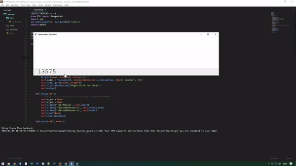

# Handwriting-Calculator
Implement MNIST dataset for handwriting recognition. Apply to calculator app.

<p align="center">
  <br/>
  <i>Progress</i>
</p>

Progress so far, calculator can understand input from handwritten number, by help of Neural Network model train with Keras with 2 hidden layer 20 unit each. But the calculator app not only gets input as a number but also operator symbol.
I still populate handwritten dataset for simple operator symbol `'+', '-', 'x', '/', '(', ')', ','` with  add_dataset.py. I think i need as much as MNIST dataset (70.000 sample) to get balance combined dataset.

## Setting Environment (optional)
Ignore this step if you dont want to use virtual environment
```
pip install virtualenv
cd Handwriting-Calculator
virtualenv venv
venv\Scripts\activate
```

## Requirements
Install required tools
```
pip install -r requirements.txt
```
**This tools require :**
- [pillow](https://github.com/python-pillow/Pillow), for grab image from tkinter canvas
- [Numpy](https://github.com/numpy/numpy), for doing image processing as an array
- [TensorFlow](https://github.com/tensorflow/tensorflow), backend for Keras
- [Keras](https://github.com/keras-team/keras), for build and train Neural Network model

## How it works
User draw handwritten number in tkinter canvas and get the image with PIL.ImageGrab.
I convert it to numpy.array, then apply thresholding to get binary array of each pixel.
Then, using connected component algorithm, we can separate each number on canvas (remember canvas can contain multiple handwriten number).
For each number, resize image to match MNIST dataset sample size, thats 28 by 28 pixel with min padding 4 pixel, by still keeping its aspect ratio. Dont forget to center the number in this image.
The last step, just throw it to model.predict to translate what number is it.

Note:
I found a problem with PIL.ImageGrab when you scale display with other than 100% (on windows, display setting > scale and layout). This mostly occured when you using HD display 1920x1080 or above, you probably scale to 150%.
So, make sure to scale with 100%.


